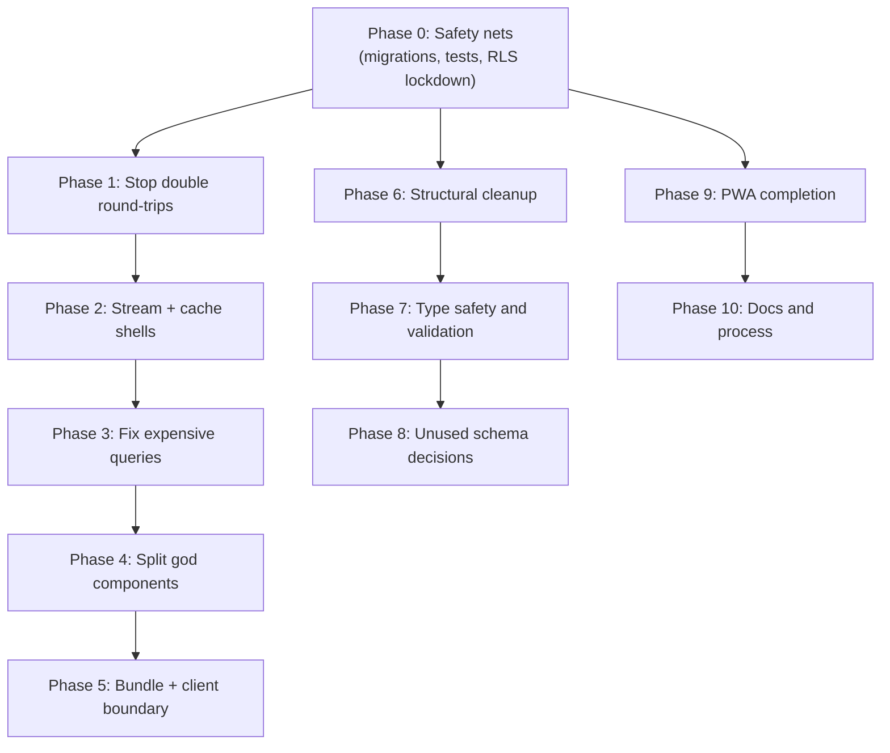

# Technical Debt Remediation Plan

Source: [project-architecture.md](project-architecture.md) §7 ("Current Technical State & Debt"). This plan sequences every issue identified there into an executable backlog, ordered so that safety nets (reproducibility, tests, security) land before refactors, and refactors land before cosmetic cleanup.

Decisions locked in for this plan (per your answers):
- **Auth stays single-user.** No Supabase Auth UI, no per-user RLS policy set. Instead: close the one real security hole (the exposed RPC) and add explicit default-deny RLS policies so the empty-policy state is documented intent, not an accident.
- **Test runner: Vitest.**
- **Scope: everything** in §7, critical through low, as one phased backlog.

Phases 0 through 3 are strictly sequential (each depends on the previous being safe to build on). Phases 6, 9, and 10 can run in parallel with the performance track once Phase 0 is done, since they touch mostly disjoint files.

---

## Phase 0 — Safety nets (Critical, do first)

These make every later phase safer and are cheap relative to their risk reduction.

### 0.1 Commit database migrations and seed data
- Export the 10 already-applied migrations from the live Supabase project (`rxfcnpdwwkfaaxnciyxj`) into a committed `supabase/migrations/` directory via `supabase db pull` or manual SQL export, covering: `add_rest_seconds_to_sets`, `add_water_ml_to_workouts`, `add_increment_workout_water_function`, `create_finance_schema`, `seed_finance_defaults_for_placeholder_user`, `create_monk_mode_schema`, `harden_monk_schema`, `add_is_completed_to_study_plan_weeks`, `add_is_completed_to_study_plan_items`, `add_gaming_minutes_to_monk_days`.
- Write a seed script (SQL or a `scripts/seed.ts`) for the 70 [exercises](lib/program/cycle.ts), 21 finance default categories, and the 6-week study plan currently seeded only on the live project.
- Add a short "Local setup" section stub here (full README rewrite happens in Phase 10) so a fresh clone has a documented path to a working database.
- Verify by running the migrations against a scratch Supabase project (or `supabase start` locally) and confirming the app boots against it.

### 0.2 Stand up Vitest and cover the highest-risk pure logic
- Add `vitest` + `@vitest/coverage-v8` as dev dependencies, plus a `vitest.config.ts` aliasing `@/*` the same way `tsconfig.json` does, and a `"test": "vitest run"` script in [package.json](package.json).
- Write unit tests for, in priority order:
  1. `scoreDay()` and `shouldResetOnFail()` in [features/monk/lib/accountability.ts](features/monk/lib/accountability.ts) — the functions that decide whether 180 days get wiped.
  2. `catchUpMissedDays()` and `finalizeDayAndMaybeReset()` in [features/monk/lib/challenge-ops.ts](features/monk/lib/challenge-ops.ts) — mock the Supabase client boundary and test the date-walking/finalization logic in isolation.
  3. `dayNumberForDate()`, `getTodayInTimezone()`, and the rest of [features/monk/lib/dates.ts](features/monk/lib/dates.ts) — timezone and DST edge cases.
  4. Warm-up percentage/rounding math in [lib/utils/warmups.ts](lib/utils/warmups.ts).
  5. Account balance derivation and weighted-average cost basis logic in [features/finance/utils.ts](features/finance/utils.ts) and the relevant parts of [features/finance/actions.ts](features/finance/actions.ts).
  6. `parseDateCell()` / `parseAmountCell()` CSV parsing helpers in [features/finance/components/forms/ImportCsvForm.tsx](features/finance/components/forms/ImportCsvForm.tsx).
- Target: every pure function listed above has at least one happy-path test and one boundary/edge-case test (midnight rollover, empty input, zero/negative amounts, day 180, day 1).

### 0.3 Close the real security hole and document the single-user model
- Revoke public execute rights on the exposed RPC: `REVOKE EXECUTE ON FUNCTION public.increment_workout_water(uuid, int) FROM anon, authenticated;` so only the service role (used server-side) can call it. This is the one finding where the empty-RLS-policy fail-closed behavior does *not* apply.
- Add explicit deny-all RLS policies (e.g. `CREATE POLICY deny_all ON <table> FOR ALL TO anon, authenticated USING (false);`) across all 29 tables, or a single reusable pattern applied per table, so the security posture is declared rather than incidental. This silences the `rls_enabled_no_policy` advisory and makes the intent auditable.
- Add a short, explicit "Security model" note (README or a `SECURITY.md`) stating: single-user prototype, all access via the service-role key on the server, `SUPABASE_SERVICE_ROLE_KEY` must never be prefixed `NEXT_PUBLIC_` or sent to the client, and real multi-user auth is out of scope until this changes.
- Re-run the Supabase security advisor after applying to confirm only the (now-expected/accepted) `auth_leaked_password_protection` warning remains, if any.

---

## Phase 1 — Stop paying twice per click (High)

Directly executes Phase 1 of the existing [.cursor/plans/pwa_mobile_performance_0b16f1e8.plan.md](.cursor/plans/pwa_mobile_performance_0b16f1e8.plan.md), now backed by the tests from Phase 0.

- Audit all `router.refresh()` call sites and remove each one that duplicates a `revalidatePath` already issued by the action it follows. Known sites: [features/fitness/components/workout/CycleDaySelector.tsx](features/fitness/components/workout/CycleDaySelector.tsx), [features/monk/components/challenge/ChallengeView.tsx](features/monk/components/challenge/ChallengeView.tsx), [features/finance/components/dashboard/EditTransactionModal.tsx](features/finance/components/dashboard/EditTransactionModal.tsx), [features/monk/components/habits/HabitsManager.tsx](features/monk/components/habits/HabitsManager.tsx), [features/monk/components/today/ResetScreen.tsx](features/monk/components/today/ResetScreen.tsx), [features/monk/components/today/SetupForm.tsx](features/monk/components/today/SetupForm.tsx), [features/monk/components/today/TodayChecklist.tsx](features/monk/components/today/TodayChecklist.tsx), and the four finance new-record forms.
- Narrow `touchMonkPaths()` in [features/monk/actions/today.ts](features/monk/actions/today.ts) from three `revalidatePath` calls to only the route actually mutated (toggling a habit on `/monk` should not invalidate `/monk/challenge` or `/monk/habits`).
- Add `useOptimistic` to the four highest-frequency interactions in [features/monk/components/today/TodayChecklist.tsx](features/monk/components/today/TodayChecklist.tsx): habit toggle, task complete, task delete, study-item toggle. Generalize the existing manual optimistic pattern in [features/fitness/components/workout/WorkoutForm.tsx](features/fitness/components/workout/WorkoutForm.tsx) (water increment with rollback) into the real hook.

## Phase 2 — Make something appear immediately (High)

- Add a `loading.tsx` skeleton (matching real layout, not a spinner) to each route group: `app/(monk)/`, `app/(fitness)/`, `app/(finance)/`.
- In [app/(fitness)/today/page.tsx](app/(fitness)/today/page.tsx) and [app/(monk)/monk/page.tsx](app/(monk)/monk/page.tsx), move the top-level `await` into a child async component wrapped in `<Suspense>` so the shell paints before data arrives.
- Add `experimental.staleTimes: { dynamic: 30, static: 180 }` to [next.config.ts](next.config.ts) so tab-to-tab navigation reuses the client router cache.
- Change `"dev": "next dev --webpack"` to `"dev": "next dev"` in [package.json](package.json) to use Turbopack (the Next 16 default); confirm nothing regresses.

## Phase 3 — Fix the expensive queries (High)

- **Fitness (highest impact).** In [features/fitness/actions/workout.ts](features/fitness/actions/workout.ts), collapse the three independent full-history scans (`getPreviousNotesByExercise`, `getPreviousSessionsByExercise`, `getPreviousTopSetsByExercise`) into one bounded query with `.limit()`, run via `Promise.all`.
- **Fitness indexes.** Add `workouts (user_id, date DESC)` and `sets (workout_id)` — currently missing entirely per the live schema audit in [project-architecture.md](project-architecture.md) §5.
- **Monk.** Rewrite `catchUpMissedDays()` in [features/monk/lib/challenge-ops.ts](features/monk/lib/challenge-ops.ts) to batch-load existing days for the full date range in one query, process in memory, then write back in one batch, instead of three awaits per missed calendar date. (Covered by the Phase 0.2 tests, so this refactor is verifiable.)
- **Finance.** Give the CoinGecko fetch in [features/finance/lib/crypto-prices.ts](features/finance/lib/crypto-prices.ts) `next: { revalidate: 300 }` instead of `cache: "no-store"`. Add `.limit()` to `getRecentTransactions`. Replace the full-transaction-table balance computation in `getAccounts()` with a bounded/aggregated approach.
- Wrap `createServerSupabaseClient` in React `cache()` in [lib/supabase/server.ts](lib/supabase/server.ts) so one request reuses one client; fix action call sites that currently build two clients (`toggleHabitLog`, `updateTask`, `deleteTask`).
- Flatten the nested retry logic so the action-level `withTransientRetry` and the fetch-level retry in `lib/supabase/server.ts` don't compose into ~12 attempts on a single flaky query.
- Replace `select("*")` with explicit column lists on the hot read paths identified above.

---

## Phase 4 — Split the three god components (High)

- Split [features/monk/components/today/TodayChecklist.tsx](features/monk/components/today/TodayChecklist.tsx) (846 lines) along its existing section boundaries: `HabitsSection`, `TasksSection`, `DigitalFastingSection`, `StudyPanel`, `ReflectionSection`, `FinalizeBar`. Keep the live `scoreDay()` preview logic in one shared place rather than duplicating it per section.
- Split [features/fitness/components/workout/WorkoutForm.tsx](features/fitness/components/workout/WorkoutForm.tsx) (738 lines) into its natural seams: set CRUD, note CRUD, water tracking, finish flow, and the three view modes (rest day / active / completed).
- Move [features/finance/actions.ts](features/finance/actions.ts) (1,031 lines, 14 exports) into the already-existing empty `features/finance/actions/` directory, split by domain: `accounts.ts`, `transactions.ts`, `categories.ts`, `portfolios.ts`, `investments.ts`.
- Also worth trimming while touching these files: [features/monk/actions/today.ts](features/monk/actions/today.ts) (697 lines), [features/monk/lib/challenge-ops.ts](features/monk/lib/challenge-ops.ts) (673 lines), [features/fitness/actions/workout.ts](features/fitness/actions/workout.ts) (615 lines, already partly addressed in Phase 3).

## Phase 5 — Bundle size and client/server boundary (Medium)

- Load `recharts` via `next/dynamic({ ssr: false })` in [features/fitness/components/analytics/ProgressionChart.tsx](features/fitness/components/analytics/ProgressionChart.tsx) (~400 KB currently blocking `/analytics`).
- Load `papaparse` lazily via `await import("papaparse")` inside the submit handler of [features/finance/components/forms/ImportCsvForm.tsx](features/finance/components/forms/ImportCsvForm.tsx).
- Load `canvas-confetti` lazily inside the water-goal celebration handler in [features/fitness/components/workout/WaterTracker.tsx](features/fitness/components/workout/WaterTracker.tsx).
- Remove the `"use client"` directive from [features/fitness/components/workout/WorkoutCompleteSummary.tsx](features/fitness/components/workout/WorkoutCompleteSummary.tsx) and [features/fitness/components/workout/PreviousSessionGhost.tsx](features/fitness/components/workout/PreviousSessionGhost.tsx) — pure markup, no hooks.
- Convert [features/fitness/components/cycle/CycleDayAccordion.tsx](features/fitness/components/cycle/CycleDayAccordion.tsx) and [features/fitness/components/history/WorkoutHistoryAccordion.tsx](features/fitness/components/history/WorkoutHistoryAccordion.tsx) from client-state expand/collapse to native `
`/`
`.
- Extract a small (~15-line) client `NavLink` leaf out of each `BottomNav` (fitness, finance, monk) so the surrounding `<nav>` markup stays a Server Component; only `usePathname()` needs to be client-side.
- Gate `CycleDaySelector` to `/today` only, or move it out of the shared fitness header, so `/history` and `/analytics` don't ship its client JS.

---

## Phase 6 — Structural consistency cleanup (Medium)

Can proceed in parallel with Phases 1–5 once Phase 0 is done.

- Standardize on the `actions/` directory pattern (fitness and monk already use it): after Phase 4 splits [features/finance/actions.ts](features/finance/actions.ts), delete the flat file so only the directory remains.
- Remove or populate the empty `hooks/` directories (`.gitkeep` only) in `features/fitness/hooks/`, `features/finance/hooks/`, `features/monk/hooks/`, and `features/core/hooks/` / `features/core/actions/` — either extract real shared hooks into them or delete the placeholders.
- Deduplicate repeated helpers:
  - `getPlaceholderUserId()` — import from [features/fitness/lib/today-workout.ts](features/fitness/lib/today-workout.ts) everywhere instead of the local copies in `history.ts` and `analytics.ts`.
  - `formatCurrency()` — extract one shared implementation used by all 4+ finance components that currently redefine it.
  - `setCategoryLabel` maps and weekday/month arrays duplicated across `WorkoutCompleteSummary.tsx`, `WorkoutHistoryAccordion.tsx`, and `ConsistencyCalendar.tsx`.
  - `getTodayDateString()` — currently defined in both `actions.ts` and `NewTransactionForm.tsx`.
- Resolve the two incompatible date models: fitness's UTC `toISOString().slice(0,10)` vs. monk's timezone-aware `Intl.DateTimeFormat` (`Europe/Sofia`). At minimum, document the divergence risk explicitly; ideally, migrate fitness's "today" calculation onto the same timezone-aware helper used by monk so both modules agree on day boundaries around midnight.
- Resolve the dual cycle-day model in fitness: `/today` advances from workout history while `/analytics`'s consistency calendar falls back to calendar math from `CYCLE_START_DATE`. Either populate `CYCLE_START_DATE` in [.env.local](.env.local) and keep both models in sync, or replace the calendar-math fallback with a query against actual workout history so there is only one source of truth.
- Consider consolidating the three near-identical `AppShell` / `Header` / `BottomNav` implementations into one parameterized shared version in `features/core/`, now that Phase 5 has already shrunk their client footprint. (Lower priority than the above — this is a nice-to-have that trades some module decoupling for less duplication.)

## Phase 7 — Type safety and validation (Medium)

- Regenerate `lib/supabase/types.ts`, `finance-types.ts`, and `monk-types.ts` from the live schema using Supabase's `generate_typescript_types` instead of hand-maintaining them, so they can't silently drift. Re-run after every future migration.
- Once generated types include real `Relationships`, remove the unsafe cast at [features/finance/actions.ts:273](features/finance/actions.ts) (`joinedRows as unknown as FinanceTransaction[] | null`) and any similar casts found elsewhere.
- Introduce Zod, define one schema per server action input, and use it for validation in place of hand-rolled checks — starting with the actions that currently have the weakest coverage: `createTransaction` (no account-UUID/ownership validation), `bulkInsertTransactions` (no server-side date validation), `createAccount` (no `accountType` enum validation beyond the TS type). Share the same schema between the form and the action where practical.
- Replace remaining `as` casts on form select handlers (e.g. `event.target.value as FinanceAccountType`) with a small typed parser/validator.
- Reassess the read-only functions currently living in `"use server"` files (e.g. `getTodayPageData`) — either accept that they're client-callable by design, or move pure reads into plain server-only modules so they aren't unnecessarily exposed as action endpoints.

## Phase 8 — Decide the fate of unused schema surface (Medium)

For each item, either wire up minimal UI/logic or formally deprecate it (drop the table/column in a migration, or mark it clearly as reserved-for-later in a comment):
- Finance: `finance_budgets` + `finance_budget_items`, `finance_fx_rates`, `finance_security_prices`, `finance_settings.base_currency`, `cashflow_transaction_id`, `finance_portfolios.account_id`, two-row transfers via `transfer_transaction_id`. Also fix `getAccounts()` to filter `is_archived`.
- Monk: `monk_goals`, `monk_commitments`, `monk_app_usage`, `monk_overrides` (note: given the Phase 0.3 decision to keep the lock absolute rather than build an unlock UI, `monk_overrides` is a strong candidate for deprecation rather than implementation). Also decide whether to implement `consecutive_fails` / `fails_in_window` reset rules in `shouldResetOnFail()` or remove those columns.
- Fitness: decide whether `zone_2` set category gets a UI path or gets removed from the enum; delete the unused exports `getPreviousExerciseSession` / `getPreviousTopSet` if nothing will call them.

---

## Phase 9 — PWA completion (Medium)

Can proceed in parallel with the tracks above.

- Generate and add the missing `/public/icon-192.png` and `/public/icon-512.png` referenced by [public/manifest.webmanifest](public/manifest.webmanifest), plus a real favicon.
- Add a service worker that precaches the app shell and static assets (e.g. via Workbox or `next-pwa`) so repeat launches from the home screen don't require a full network round-trip.
- Remove the unused `@supabase/ssr` dependency from [package.json](package.json) — no browser client, no cookie auth exists in the app.
- Port [public/manifest.webmanifest](public/manifest.webmanifest) to `app/manifest.ts` for type safety.
- Update the root metadata in [app/layout.tsx](app/layout.tsx) — currently still branded "Cycle Tracker" / "14-day hybrid fitness cycle tracker" from when this was fitness-only — to reflect all three modules.

## Phase 10 — Documentation and process (Low)

- Rewrite [README.md](README.md): remove the unmodified `create-next-app` boilerplate, document the Supabase env vars, the single-user model (cross-reference the Phase 0.3 security note), how to run migrations/seed (Phase 0.1), and how to run tests (Phase 0.2).
- Retire [project-context.md](project-context.md): either delete it or add a one-line pointer to [project-architecture.md](project-architecture.md) as the current source of truth, since it predates Monk Mode and is now stale.
- Close out or rewrite the stale plan documents: mark the six completed todos in the Monk Mode Phase 1 plan as done, and update `.cursor/plans/pwa_mobile_performance_0b16f1e8.plan.md` todos to reflect what Phases 1–3 of this plan actually completed.
- Rename or re-scope [Study_plan.md](Study_plan.md) (or add a clarifying header) since it reads like a Monk Mode spec but is actually personal seed content for the study-plan feature.
- Add `.DS_Store` to [.gitignore](.gitignore) and remove already-committed instances from the repo.
- Add a minimal CI workflow (GitHub Actions or equivalent) running `npm run lint` and `npm run test` on push/PR, now that Phase 0.2 gives it something real to run.
- Going forward, adopt descriptive commit messages (historical messages like `"Changes"` x6 are not worth rewriting, but new commits should follow a clear convention — e.g. `type: short description`).
