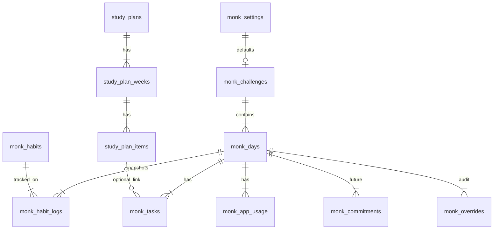
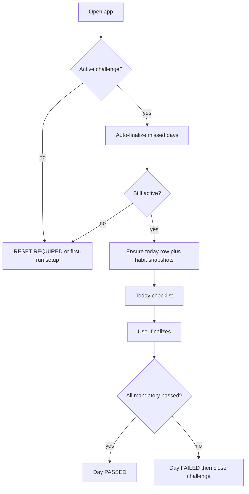

# Monk Mode Phase 1

## Existing architecture (what we reuse vs. invent)

The app is a **feature-driven modular monolith**: Next.js App Router, Server Components + Server Actions, Supabase with the service role, single-user `PLACEHOLDER_USER_ID`. There is **no auth**, no local `supabase/` folder, and no existing habit/task/challenge tables.

| Existing | Reuse? |
|---|---|
| [lib/supabase/server.ts](lib/supabase/server.ts), [lib/utils/placeholder-user.ts](lib/utils/placeholder-user.ts) | Yes |
| [features/core/components](features/core/components) (`Button`, `NumberInput`, `SegmentedControl`) | Yes |
| Shell / bottom-nav pattern from fitness/finance | Copy into a new monk shell — do not share fitness `AppShell` |
| [ConsistencyCalendar.tsx](features/fitness/components/analytics/ConsistencyCalendar.tsx) | Visual reference only; new 180-day grid |
| `workouts`, `sets`, finance tables | **No** — different domain |
| Study plan file [Study_plan.md](Study_plan.md) | Seed into separate `study_*` tables (loose coupling) |

Remote project `Tracking_app` (`rxfcnpdwwkfaaxnciyxj`) already has fitness + finance tables, RLS enabled with **no policies**, migrations applied via MCP. Same pattern: `apply_migration` on the remote DB, then hand-written types in `lib/supabase/monk-types.ts` merged into [lib/supabase/types.ts](lib/supabase/types.ts).

Home ([app/page.tsx](app/page.tsx)) gets a third card → `/monk`.

**Accountability defaults (confirmed):** any missed mandatory item fails the day; one failed day resets the 180-day challenge. Both values are stored on the challenge so they can change later without rewriting history.

---

## Schema (complete system, created in Phase 1)

Normalized, `monk_` / `study_` prefixes, UUID PKs (`gen_random_uuid()`), `user_id → auth.users(id) ON DELETE CASCADE`, `timestamptz`, RLS on, no policies yet (same gap as fitness/finance). No analytics tables — streaks and percentages are computed.



### Domain tables

**`monk_settings`** (1:1 per user) — current defaults for *new* challenges: `timezone` (`Europe/Sofia`), `social_media_limit_minutes` (30), `max_mandatory_failures_allowed` (0), `reset_rule` (`on_any_fail` | `consecutive_fails` | `fails_in_window`) plus the unused window/consecutive fields.

**`monk_challenges`** — one row per attempt. Snapshots the rules at start so mid-run setting edits do not rewrite history. Columns: `attempt_number`, `started_on`, `target_days` (180), `status` (`active` | `failed` | `completed` | `abandoned`), `ended_on`, `ended_day_number`, `successful_days_count`, plus the rule snapshot. **Partial unique index:** one `active` challenge per user. **Never delete** attempts.

**`monk_days`** — created on first open of that calendar date (not pre-inserted 180 empty rows). The 180-cell grid is generated from `started_on + 0..179`. Key columns: `challenge_id`, `date`, `day_number`, `status` (`in_progress` | `passed` | `failed`), `finalized_at`, `finalization_source` (`manual` | `automatic` | `system_missed`), digital-fasting snapshot (`social_media_limit_minutes`, `social_media_actual_minutes`), optional reflection fields (`accomplished`, `failed_to_do`, `why_failed`, `improve_tomorrow`) for Phase 2 UI. Unique `(challenge_id, date)` and `(challenge_id, day_number)`.

**`monk_habits`** — recurring definitions: `name`, `is_mandatory`, `is_active`, `sort_order`, optional `target_value` + `target_unit` (e.g. 5 → 10 pages). Edits apply to **future** days only.

**`monk_habit_logs`** — per-day snapshot: `is_completed`, `completed_at`, `is_mandatory_snapshot`, `target_value_snapshot`, `target_unit_snapshot`. Unique `(day_id, habit_id)`. Opening today copies active habits into logs.

**`monk_tasks`** — same-day only: `title`, `is_mandatory`, `is_completed`, `completed_at`, `sort_order`, nullable `study_item_id`.

**`monk_app_usage`** — optional per-app minutes (`app_name`, `minutes`). Phase 1 UI writes the **total** onto `monk_days`; this table is ready for Instagram/TikTok lines later.

**`monk_goals`**, **`monk_commitments`** (ranked 1–3 morning non-negotiables), **`monk_overrides`** (entity/field/old/new/reason/timestamp) — created now, **no Phase 1 UI** except a lock that refuses casual edits after finalize. A later unlock-with-reason flow writes `monk_overrides`.

### Study tables (own domain, optional FK only)

**`study_plans`** → **`study_plan_weeks`** (`week_number`, `focus`, `build_target`) → **`study_plan_items`** (`kind`: `resource` | `build` | `task`, `title`, `url`). Seeded from [Study_plan.md](Study_plan.md).

`monk_tasks.study_item_id` is the only join. Challenge reset does **not** reset the study plan (you do not restart TypeScript because you broke digital fasting).

Indexes: `(user_id, date)` on days, `(challenge_id, day_number)`, `(day_id, sort_order)` on tasks/logs. `updated_at` trigger copied from finance.

---

## Pass/fail, lock, and reset

Pure function, threshold = **0**:

```
mandatoryFailures =
  incomplete mandatory habit logs
  + incomplete mandatory tasks
  + 1 if social_media_actual_minutes is null OR > limit

PASSED iff mandatoryFailures == 0
```

Digital fasting is always a mandatory component. Unlogged minutes = fail (anti-cheat). Optional items never affect the result. Reflection never affects the result.

**Lock:** after `finalized_at` is set, task/habit/minutes updates are rejected. Phase 1 has no override UI.

**Reset (`on_any_fail`):**

1. Day marked `failed`, `finalized_at` set.
2. Challenge → `failed`, `ended_on` = that date, `ended_day_number` = N, `successful_days_count` = passed days (never deleted).
3. UI goes to **RESET REQUIRED**. User must explicitly start Challenge #N+1 (does not auto-start). New attempt `started_on` = next local calendar day.

**Missed days:** on app open, any date from `started_on` through yesterday with no finalized day is auto-finalized. A missing row is created and marked `failed` / `system_missed` — that single miss ends the challenge. Later skipped calendar days are not attached to the dead attempt.

**Streaks (computed, not stored):**
- Current = passed days in the **active** attempt (by construction they are consecutive from day 1).
- Best = max `successful_days_count` across attempts, including current.
- Grid: green passed, red failed, amber in progress, empty future. Subtle markers at days 7 / 30 / 60 / 90 / 120 / 180.



---

## Study plan on today's checklist (light, Phase 1)

Compute current week from `study_plans.starts_on` (set when the user starts following the plan, independent of monk reset). Show a **This week's study** panel (focus + items). Tapping an item adds a `monk_task` with `study_item_id` — user chooses whether that task is mandatory. Weekly build targets are **not** auto-mandatory daily items (a 6-week capstone cannot fail Monday). After week 6, the panel shows the plan as complete.

---

## Phase 1 UI (only this)

New route group `app/(monk)/` with its own shell (`max-w-md`, zinc-950, serious type, **no confetti / no XP**). Pass state: large `DAY n / 180` and streak in emerald. Fail state: full-width red **CHALLENGE FAILED / n DAYS COMPLETED / RESET REQUIRED**.

| Route | Purpose |
|---|---|
| `/monk` | Today: habits, tasks (CRUD + reorder + mandatory toggle), digital fasting (target ≤ N / actual / live PASSED\|FAILED), finalize with confirm dialog, study-week panel |
| `/monk/challenge` | 180-cell grid, Day n/180, current/best streak, passed/failed counts, attempt history |
| `/monk/habits` | Create/edit/deactivate/reorder habits and page/minute targets |

First-run: if no challenge exists, a short setup (habits, 30-min limit, start). If last challenge failed, blocking reset screen.

Server actions under `features/monk/actions/` (`today.ts`, `challenge.ts`, `habits.ts`). Pass/fail + catch-up in `features/monk/lib/accountability.ts`. “Today” is `Europe/Sofia` via `features/monk/lib/dates.ts`.

---

## Edge cases

- Habit added mid-run → appears from today forward, no backfill.
- Habit target 5→10 pages → new logs snapshot 10; old logs keep 5.
- Habit deactivated → hidden on new days; historical logs remain.
- Zero mandatory habits + no tasks: digital fasting still decides the day. Setup should create at least one mandatory habit.
- Finalize at 23:59 vs open at 00:01 Sofia: catch-up treats yesterday as due.
- 180 passed days → `completed`, no auto-restart.
- Cannot delete historical challenges or days.
- Single-user / service-role: same as today; RLS policies wait for real auth.

---

## Hold for Phase 2 (schema present, no UI)

Override history viewer; weekly/monthly analytics dashboard (this week 6/7, avg social minutes, habit %); morning 3 non-negotiables; evening shutdown; reflection prompts; discipline score (secondary only); Screen Time import.

**Suggested later, still simple:** weekly review of repeated failures; milestone copy at 30/90/180; optional push/email if yesterday was not finalized (dead-man reminder). Do not add a points game.

---

## Implementation order after approval

1. Remote migration (`monk_*` + `study_*` + seed 6-week plan + placeholder-user settings row) via Supabase MCP; advisors pass; types in `lib/supabase/monk-types.ts`.
2. Accountability lib + server actions.
3. Today checklist + finalize + missed-day catch-up.
4. Habits management.
5. Challenge grid, stats, attempt history, failed/reset flow.
6. Home card + first-run setup.
