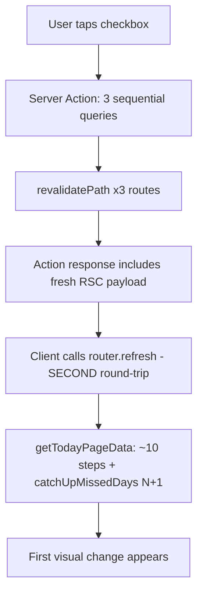

# Next.js PWA Mobile Performance Plan

## Diagnosis: why it feels slow

The slowness is not one bug. Six layers of "never cache anything, never show anything early" stack on top of each other. Every button click currently pays for all of them.

### 1. Every click is two round-trips, not one

Thirteen components call `router.refresh()` immediately after a server action that already called `revalidatePath`. When a Server Action calls `revalidatePath`, Next.js already includes the fresh RSC payload for the current route in the action's response. The extra `router.refresh()` fetches that same payload a second time.

```234:237:features/monk/components/today/TodayChecklist.tsx
  function act(fn: () => Promise<ActionResult>) {
    startTransition(async () => {
      runResult(await fn(), setError, refresh);
    });
  }
```

### 2. Nothing is optimistic, so the UI freezes for both round-trips

`useOptimistic` and `useActionState` are used zero times in the codebase. Fourteen components use `useTransition`, but only to *disable* the button while waiting. A habit checkbox does not visually toggle until the server write, the revalidation, and the full page refetch have all completed.

```297:300:features/monk/components/today/TodayChecklist.tsx
                  <button
                    type="button"
                    disabled={locked || isPending}
                    onClick={() => act(() => toggleHabitLog(habit.id, !habit.is_completed))}
```

### 3. Nothing streams — this is the "waiting to render" you feel

There are **zero** `loading.tsx` files and **zero** `<Suspense>` boundaries in the entire app. Every page blocks until its last query resolves before sending any HTML. Combined with `export const dynamic = "force-dynamic"` on all 13 data pages, there is no static shell to paint.

### 4. Caching is explicitly disabled at every layer

- `lib/supabase/server.ts:56` forces `cache: "no-store"` on every single Supabase REST response.
- All 13 data pages export `force-dynamic`.
- `staleTimes.dynamic` defaults to `0`, so the client router cache keeps nothing. Switching between `/monk` and `/monk/habits` and back refetches everything, every time.
- `createServerSupabaseClient()` builds a brand-new client on every call and is not memoized with React `cache`. Several actions build two clients per invocation.

### 5. The refetch after a click is far more expensive than the write

The writes are lean (1 to 3 queries). The refetch triggered afterwards is not:

- **Monk**: one checkbox tap calls `revalidatePath` on three separate routes, then refetches `getTodayPageData()`, which runs `catchUpMissedDays` — an N+1 loop awaiting three queries per calendar date.
- **Fitness**: saving one set refetches `getTodayWorkoutData()`, which runs about 11 sequential steps including **three separate full scans of your entire completed workout history**, each with no `.limit()`, run sequentially rather than in parallel.
- **Finance**: any mutation refetches five readers in parallel, one of which hits the CoinGecko API with `cache: "no-store"` on every single page view.

```383:403:features/fitness/actions/workout.ts
  const previousNotesByExercise = await getPreviousNotesByExercise(...);
  const previousSessionsByExercise = await getPreviousSessionsByExercise(...);
  const previousTopSetByExercise = await getPreviousTopSetsByExercise(...);
```

### 6. Retry wrappers are nested and can stall for seconds

`withTransientRetry` retries up to 4 times with exponential backoff, and it wraps queries whose *fetch layer* already retries up to 3 times with its own backoff. A single flaky query can burn 12 attempts and several seconds of pure waiting.

### Request flow today



---

## Phase 0: Measure before changing anything

You said it is slow in both dev and production. Some of the dev slowness is not your app: `package.json` runs `next dev --webpack`, which opts out of Turbopack and compiles each route on demand the first time you visit it.

- Establish a real baseline: `npm run build && npm start`, then load it on your phone over the network. Compare against dev to separate compile lag from app lag.
- Change `dev` to `next dev` (Turbopack is the Next 16 default) and confirm nothing breaks. Keep `--webpack` only if something depends on it.
- Wrap the three worst readers (`getTodayPageData`, `getTodayWorkoutData`, `getPortfolioHoldings`) in `console.time`/`timeEnd` so you get server-side numbers instead of guesses.
- Confirm your Supabase project region. Every query in this app is a serverless-to-Supabase network hop; a cross-continent region silently multiplies all of the counts above.

Do not skip this — it tells you how much of Phases 1 to 5 you actually need.

## Phase 1: Stop paying twice per click (biggest perceived win, lowest risk)

- Audit all 13 `router.refresh()` call sites. Remove the call wherever the action already calls `revalidatePath` for the route the user is currently on. Keep it only where the action revalidates a *different* route. The relevant files are [TodayChecklist.tsx](features/monk/components/today/TodayChecklist.tsx), [HabitsManager.tsx](features/monk/components/habits/HabitsManager.tsx), [CycleDaySelector.tsx](features/fitness/components/workout/CycleDaySelector.tsx), [EditTransactionModal.tsx](features/finance/components/dashboard/EditTransactionModal.tsx), and the four finance forms.
- Narrow `touchMonkPaths()` in [features/monk/actions/today.ts](features/monk/actions/today.ts) from three `revalidatePath` calls to just the route being mutated. Toggling a habit on `/monk` should not invalidate `/monk/challenge` and `/monk/habits`.
- Add `useOptimistic` to the high-frequency toggles so the checkbox flips on tap and reconciles when the server responds: habit toggle, task complete, task delete, and study-item toggle in `TodayChecklist`.
- Copy the pattern already working in [WorkoutForm.tsx](features/fitness/components/workout/WorkoutForm.tsx) (lines 605 to 626 do a manual optimistic water increment with rollback) and generalize it with the real `useOptimistic` hook.

## Phase 2: Make something appear immediately

- Add a `loading.tsx` to each route group: `app/(monk)/`, `app/(fitness)/`, `app/(finance)/`. Skeletons matching the real layout, not spinners.
- Split the heavy pages so the shell paints before the data arrives. In [app/(fitness)/today/page.tsx](app/(fitness)/today/page.tsx) and [app/(monk)/monk/page.tsx](app/(monk)/monk/page.tsx), move the `await` into a child async component wrapped in `<Suspense>` instead of awaiting at the top of the page.
- Add `experimental.staleTimes` to [next.config.ts](next.config.ts) so tab-to-tab navigation reuses the client cache instead of refetching:

```ts
const nextConfig: NextConfig = {
  experimental: {
    staleTimes: { dynamic: 30, static: 180 },
  },
}
```

## Phase 3: Fix the expensive queries

- **Fitness, highest impact.** Collapse the three history helpers in [features/fitness/actions/workout.ts](features/fitness/actions/workout.ts) into one query. They each independently re-fetch your entire completed-workout list. Fetch that list once, add a `.limit()` (you only need the most recent session per exercise), and run the remaining lookups in `Promise.all`.
- **Monk.** Rewrite `catchUpMissedDays` in [features/monk/lib/challenge-ops.ts](features/monk/lib/challenge-ops.ts) (lines 475 to 500) to batch-load existing days for the whole date range in one query, then process in memory, then write back in one batch — instead of three awaits per missed date.
- **Finance.** Give the CoinGecko fetch in [features/finance/lib/crypto-prices.ts](features/finance/lib/crypto-prices.ts) a real cache (`next: { revalidate: 300 }` instead of `cache: "no-store"`). An ETH price does not need to be sub-second fresh, and right now it blocks every `/finance` render. Add `.limit()` to `getRecentTransactions` and stop computing account balances by fetching every transaction ever.
- Wrap `createServerSupabaseClient` in React `cache` so one request reuses one client, and fix the actions that build two (`toggleHabitLog`, `updateTask`, `deleteTask`).
- Flatten the nested retry logic so `withTransientRetry` and the fetch-level retry in [lib/supabase/server.ts](lib/supabase/server.ts) do not multiply into 12 attempts.
- Add the Supabase indexes these access patterns need: `workouts (user_id, date DESC)` filtered on `completed_at IS NOT NULL`, `sets (workout_id)`, `exercise_notes (workout_id)`, `monk_days (challenge_id, day_number)`, and `user_id` on the finance tables.
- Replace `select("*")` with explicit column lists on the hot read paths.

## Phase 4: Bundle and client/server boundaries

There is currently **no** `next/dynamic` or `React.lazy` anywhere in the repo, so every heavy library ships in its route's initial chunk.

- Load `recharts` via `next/dynamic` with `ssr: false` in [ProgressionChart.tsx](features/fitness/components/analytics/ProgressionChart.tsx). This is roughly 400 KB currently blocking `/analytics`.
- Load `papaparse` lazily inside the submit handler of [ImportCsvForm.tsx](features/finance/components/forms/ImportCsvForm.tsx) via `await import("papaparse")`. It is only needed after a file is chosen.
- Load `canvas-confetti` lazily inside `fireGoalConfetti()` in [WaterTracker.tsx](features/fitness/components/workout/WaterTracker.tsx). It currently ships on `/today` for an effect that fires once a day at most.
- Do **not** add `recharts` or `date-fns` to `experimental.optimizePackageImports` — Next 16 already includes both in its default list. That option only tree-shakes; it does not code-split. `next/dynamic` is the actual fix.

On the `'use client'` audit, 35 files carry the directive. Most genuinely need it (forms, timers, modals). The removable ones:

- **Delete the directive outright**: [WorkoutCompleteSummary.tsx](features/fitness/components/workout/WorkoutCompleteSummary.tsx) and [PreviousSessionGhost.tsx](features/fitness/components/workout/PreviousSessionGhost.tsx) have no hooks and no event handlers. They are pure markup.
- **Replace `useState` with native `<details>`**: [CycleDayAccordion.tsx](features/fitness/components/cycle/CycleDayAccordion.tsx) and [WorkoutHistoryAccordion.tsx](features/fitness/components/history/WorkoutHistoryAccordion.tsx) use client state purely for expand/collapse. `<details name="...">` gives you exclusive-open groups with zero JS.
- **Shrink the client leaf**: the three `BottomNav` files (monk, fitness, finance) are ~100 lines of static nav markup that go client-side solely for `usePathname()`. Keep the `<nav>` as a Server Component and extract a ~15-line `NavLink` client child.
- **Split the modal out**: [CategoryTransactionsAccordion.tsx](features/finance/components/dashboard/CategoryTransactionsAccordion.tsx) can use `<details>` for expansion and keep only the edit-modal trigger as a client leaf.
- Move `CycleDaySelector` out of the shared fitness header, or gate it to `/today`. It currently ships client JS to `/history` and `/analytics`, which cannot use it.

Be realistic about the payoff here: this reduces hydration cost and route chunk size, which helps first load and low-end phones. It will not fix click latency — Phases 1 through 3 do that.

## Phase 5: Migrate to Next 16 Cache Components

You confirmed this stays a single-user app with a hardcoded `PLACEHOLDER_USER_ID` and the service-role key, no auth and no RLS. That is the ideal case for aggressive server-side caching: there is no per-user cache to poison.

- Set `cacheComponents: true` in [next.config.ts](next.config.ts). This makes Partial Prerendering the default.
- Remove `export const dynamic = "force-dynamic"` from all 13 pages.
- Remove the blanket `cache: "no-store"` from [lib/supabase/server.ts](lib/supabase/server.ts) so cache directives can actually take effect.
- Add `'use cache'` plus `cacheTag(...)` to the read functions: `getTodayPageData` tagged `monk-today`, `getTodayWorkoutData` tagged `fitness-today`, `getWorkoutHistory` tagged `fitness-history`, and the finance readers.
- Swap `revalidatePath` for `updateTag` in the mutations. `updateTag` is built exactly for your case — the docs call it "read-your-own-writes," expiring the entry immediately so you see your own change instead of stale content, and it is scoped to a tag rather than nuking a whole route.
- Add `export const unstable_instant = { prefetch: 'static' }` to the main routes. It validates at dev and build time that each route produces an instant static shell, and names the specific component that blocks navigation when one does.
- Read `node_modules/next/dist/docs/01-app/02-guides/migrating-to-cache-components.md` before starting this phase.

## Phase 6: Actual PWA behavior

Your PWA is currently installable metadata only, and it is partly broken.

- `public/manifest.webmanifest` references `/icon-192.png` and `/icon-512.png`. **Neither file exists.** There is also no `favicon.ico` and no `app/icon.*`. Generate them.
- There is no service worker anywhere in the repo, and no `next-pwa` or Workbox. Every navigation, including repeat visits, is a full network round-trip. Add a service worker that precaches the app shell and static assets so launching from the home screen paints instantly.
- Consider porting `public/manifest.webmanifest` to `app/manifest.ts` for type safety.
- Delete the unused `@supabase/ssr` dependency — there is no browser client and no cookie auth in the app.

## Expected outcome

Phases 1 and 2 should deliver most of the felt improvement, because they cut round-trips per click from two to one and put pixels on screen before data arrives. Phase 3 cuts the cost of the remaining round-trip. Phase 5 is what makes navigation genuinely instant. Phase 4 and Phase 6 improve cold start and install quality.